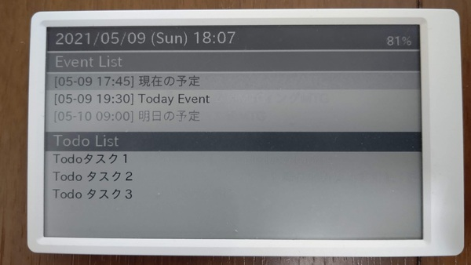

# M5Paper My DashBoard

A PlatformIO Project for [M5Paper](https://docs.m5stack.com/en/core/m5paper).
This is a personal dashboard application.



## Features

Subscribe MQTT topics and display the followings,

- 3 calendar Events, from `calendar` topic
- 3 Todos, from `todo` topic

## Requirements

- [M5Paper](https://docs.m5stack.com/en/core/m5paper)
- SD card
- [PlatformIO IDE](https://marketplace.visualstudio.com/items?itemName=platformio.platformio-ide)
- MQTT Broker

## Preparation

### MQTT Broker

I recommend Node-RED on Rasberry Pi.

### SD card

1. Download TTF FOntfile, [IPAex Gothic font](https://moji.or.jp/wp-content/ipafont/IPAexfont/ipaexg00401.zip) recommended
1. Save *.ttf* file as *font.ttf* file to root dir of SD card
1. Insert SD card into your M5Paper

## Usage

1. Prepare your MQTT Broker.
1. Connect Your M5Paper device to your PC.
1. Run the following commands to build and install this app.
    ```bash
    git clone https://github.com/HeRoMo/m5paper-dashboard.git
    cd m5paper-dashboard
    export WIFI_SSID=<your wifi ssid>
    export WIFI_PASSWORD=<your wifi password>
    export MQTT_BROKER=<your mqtt broker hostname>
    pio run -t upload
    ```

## LICENSE

[MIT](LICENSE)

